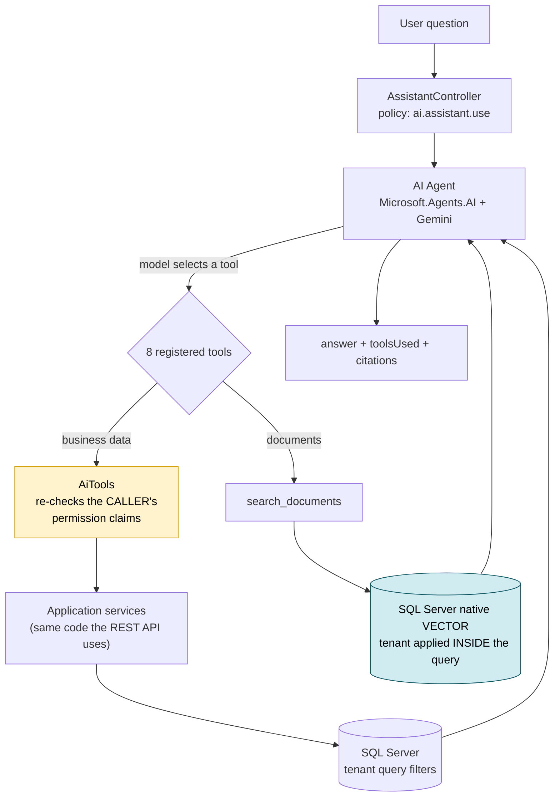

# Grocery Platform — Multi-Tenant Retail SaaS with Agentic AI

[](https://github.com/IAmVedAwate/grocery-platform/actions/workflows/ci.yml)


A multi-tenant SaaS platform for independent grocery and retail stores — barcode-first billing, real-time inventory, purchasing, and an **AI agent that answers questions about the store's own live data and uploaded documents**, scoped to the asking user's permissions.

Built to replace the spreadsheet-plus-legacy-POS pattern most independent stores run on. Also built as an engineering artifact: **every significant architecture decision is recorded with its alternatives and trade-offs** in [10 ADRs](./docs/decisions/), and the layer boundaries those decisions describe **fail the build** if violated.

> **Stack** · .NET 10 · ASP.NET Core Web API · Entity Framework Core · SQL Server 2025 (native `VECTOR`) · Microsoft Agent Framework · Microsoft.Extensions.AI · Google Gemini · Next.js 16 · React 19 · TypeScript · Tailwind CSS · xUnit · Testcontainers · Docker · GitHub Actions

---

## Highlights

| | |
|---|---|
| **76% fewer logical reads** | 9,423 → 2,220 on the sales-by-product report, with **88% less CPU** (887 ms → 103 ms), via covering-index design and T-SQL execution-plan analysis — [method, plans and `STATISTICS IO/TIME` output](./docs/architecture/sql-performance-pass.md) |
| **140 automated tests** | 70 unit · 3 architecture · 67 integration against **real SQL Server** via Testcontainers — no in-memory provider, no mocked database |
| **8 permission-checked AI tools** | The model chooses; the backend re-checks *the caller's* permissions before every tool executes |
| **Tenant-pre-filtered RAG** | The tenant boundary is applied *inside* the vector query, not to its results — [proven by its own test](./backend/tests/Integration/SearchDocumentsTenantIsolationTests.cs) |
| **14 documented root-cause analyses** | Real incidents hit during development: symptom → root cause → fix → what would have caught it sooner ([troubleshooting.md](./docs/operations/troubleshooting.md)) |

---

## The assistant, actually running

Two real responses from `POST /api/v1/assistant/ask` against a seeded store. Same endpoint, same agent — the model decides whether the answer lives in the database or in an uploaded document.

#### Live business data → tool call

**“what is low stock products in inventory?”**

> The following products are currently at or below their low-stock threshold:
>
> 1. **Britannia Bread** (`BREAD-400`) — On Hand: **6**, Threshold: 20
> 2. **Tea Powder 500g** (`TEA-500`) — On Hand: **4**, Threshold: 8
> 3. **Toor Dal 1kg** (`DAL-TOOR-1K`) — On Hand: **8**, Threshold: 15

```json
{ "toolsUsed": ["get_low_stock_items"], "citations": [] }
```

#### Uploaded document → RAG with a citation

**“What should an employee do if a sale was recorded incorrectly?”**

> 1. **Do NOT delete the sale.**
> 2. **Issue a refund** against the original invoice from the Sales page (requires the `sales.refund` permission).
> 3. **Record the correct sale** as a new transaction.
> 4. If the error is discovered *after* the customer has left, a supervisor must approve the correction before the refund is issued.

```json
{
  "toolsUsed": ["search_documents"],
  "citations": [
    {
      "fileName": "store-policy.md",
      "snippet": "If an employee records a sale incorrectly, they must NOT delete the sale. Instead, raise a refund against the original invoice…"
    }
  ]
}
```

Nothing in either answer is invented. The first came from SQL through the same application service the REST API uses; the second from a chunk retrieved out of the vector store. Both are traceable through the `toolsUsed` and `citations` fields the endpoint returns.

---

## How a question gets answered



The two highlighted boxes are the point: **the model chooses a tool, but choosing is never authorization.** Each tool independently verifies the signed-in user's own permissions before touching data, and document retrieval filters by tenant *inside* the vector search rather than discarding another store's results afterwards.

---

## Run it locally

Requires Docker Desktop, the .NET 10 SDK, and Node LTS.

```bash
git clone https://github.com/IAmVedAwate/grocery-platform.git
cd grocery-platform
cp .env.example .env                              # fill in local values — never commit .env

docker compose --env-file .env -f deployment/docker-compose.yml up -d sqlserver

cd backend/src/Api && dotnet run                  # http://localhost:5292  (migrations auto-apply in Development)
cd web && npm install && npm run dev              # http://localhost:3000
```

Register a store at `/register` and you're in.

```bash
cd backend && dotnet test                         # all three suites
```

**No Gemini API key is needed** for anything except the AI assistant and document upload — the AI client is resolved lazily, so the app boots and every other feature works without one. The test suite never calls the real API, and the credential is explicitly blanked in the test host so a configured key can't turn a CI run into a bill.

Full walkthrough: [docs/operations/local-development.md](./docs/operations/local-development.md).

---

## Architecture

```
backend/
  src/Api             13 REST controllers, policy-based authorization, middleware, DI composition
  src/Application     use cases, DTOs, repository/UoW interfaces      ← no Infrastructure reference
  src/Domain          entities + business rules                       ← no EF Core, no ASP.NET Core
  src/Infrastructure  EF Core, Identity, storage, Gemini/RAG adapters
  src/Shared          Problem Details error model, permission constants
  tests/              Unit · Integration (Testcontainers) · Architecture (NetArchTest)
web/                  Next.js App Router, token-based design system, ⌘K command palette, drawer UI
docs/                 PRD · ROADMAP · 10 ADRs · architecture · security · testing · operations
deployment/           Dockerfile (multi-stage, non-root), docker-compose
```

A **modular monolith** — 8 business modules (Identity, Catalog, Inventory, Purchasing, Sales, Reporting, Notifications, AI) with clean dependency direction, chosen over microservices for a reason that's written down ([ADR-001](./docs/decisions/ADR-001-modular-monolith-vs-microservices.md)).

The dependency rule isn't a convention anyone has to remember — `Architecture.csproj` asserts it, so a `Domain` reference to EF Core breaks CI.

---

## What's worth looking at

**Multi-tenancy that's proven, not asserted.** Shared schema with EF Core global query filters keyed on a tenant context resolved *only* from the validated JWT — never a header or body field. A dedicated suite attempts cross-tenant reads and asserts they fail with **404, never 403** (a 403 confirms the record exists). Real bugs were caught this way — a stale tenant context leaking into a query filter, and ASP.NET Identity's defaults assuming one global tenant — both written up in [troubleshooting.md](./docs/operations/troubleshooting.md). → [ADR-002](./docs/decisions/ADR-002-multi-tenancy-strategy.md)

**Per-user permissions, not roles.** Access is a per-person checklist of permission keys, editable at any time; roles exist only to seed the first admin's set at registration. A cashier and a manager differ by exactly the keys ticked for them. Enforced by a custom `IAuthorizationPolicyProvider` + handler.

**Auth hardening with the boring parts done.** ASP.NET Core Identity for hashing, short-lived JWTs, and **refresh-token rotation with reuse detection** — replaying a rotated token revokes the entire family. Login failures are indistinguishable across *status, body and elapsed time*: an unknown email used to answer in ~12 ms against ~400 ms for a wrong password, which leaks account existence by stopwatch regardless of what the response says. Both now sit at ~160 ms. → [security-model.md](./docs/security/security-model.md)

**Concurrency-safe checkout.** The "two cashiers, last two units" race is handled with a `rowversion` concurrency token and proven by a test that fires simultaneous sales and asserts exactly one wins.

**AI with the authorization boundary in the right place.** One agent exposes 8 tools (`search_products`, `get_inventory`, `get_low_stock_items`, `get_sales_summary`, `get_purchase_order_status`, `get_supplier_status`, `get_customer_summary`, `search_documents`). The model decides *which* to call; every tool independently re-checks the caller's real permission claims before executing, so the model choosing a tool is never itself authorization. → [ai-architecture.md](./docs/architecture/ai-architecture.md)

**RAG without new infrastructure.** Upload → paragraph-aware chunking → embeddings → **SQL Server 2025 native `vector` column in the same database as everything else** → tenant-pre-filtered similarity search → grounded answer with citations. No second datastore. → [ADR-003](./docs/decisions/ADR-003-sql-server-native-vector-vs-pgvector-vs-azure-ai-search.md)

**LLM resilience and cost control.** Gemini returning *"this model is currently experiencing high demand"* used to surface as a bare 500. Now: SDK-level exponential backoff with jitter, then an ordered **model-fallback decorator** over `IChatClient`, then a graceful **503** with a retry message — because retrying one endpoint cannot fix an overloaded model, but a second model can. Deliberately *not* Polly: the SDK already backs off, and a second generic layer would multiply attempts and hide which one gave up.

**A documented provider pivot.** The plan was OpenAI ([ADR-005](./docs/decisions/ADR-005-openai-direct-vs-azure-openai.md)); the implementation is Gemini ([ADR-009](./docs/decisions/ADR-009-llm-provider-gemini-direct.md), which supersedes it). Because the AI layer was built against `Microsoft.Extensions.AI`'s provider-neutral interfaces, the swap touched one DI registration block. The superseded ADR is kept rather than rewritten — the reasoning that led to the change is itself the useful part.

**Tests that hit real infrastructure.** Real SQL Server via Testcontainers, a real ONNX model for product colour extraction, real file I/O. The one deliberate exception is the LLM: a deterministic fake embedding generator keeps the suite token-free. → [testing-strategy.md](./docs/testing/testing-strategy.md)

---

## Status

| Phase | Scope | State |
|---|---|---|
| 1 | Foundation, identity, multi-tenancy, catalog | ✅ Done |
| 2 | Inventory, purchasing, sales/checkout, customers | ✅ Done |
| 3 | Security hardening, SQL performance, observability | ✅ Done |
| 4 | Cloud deployment (Azure) | ⏳ Not started |
| 5 | Agentic AI + RAG | ✅ Done |

**Known gaps are named explicitly** rather than left implied — no cloud deployment yet, no distributed cache, no AI evaluation harness, no browser E2E suite. The full honest list lives in [skills-inventory.md](./docs/checkpoints/skills-inventory.md#4-real-gaps-named-honestly), including things that make the project look worse. That document is deliberately part of the repo.

---

## License

Portfolio project — not currently licensed for reuse.
